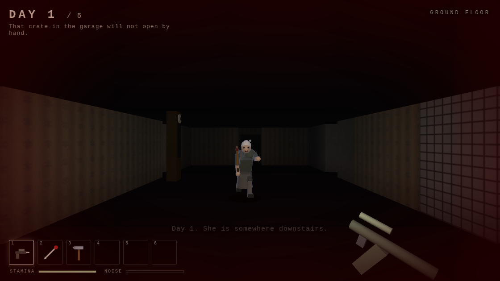
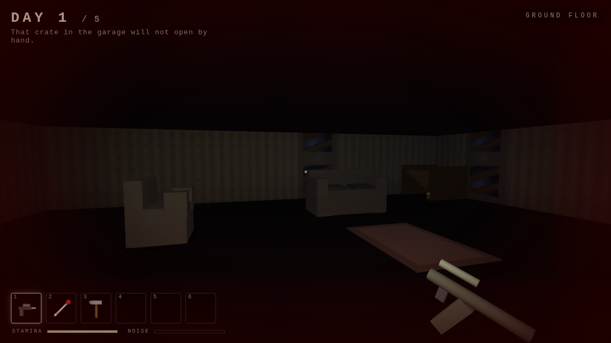
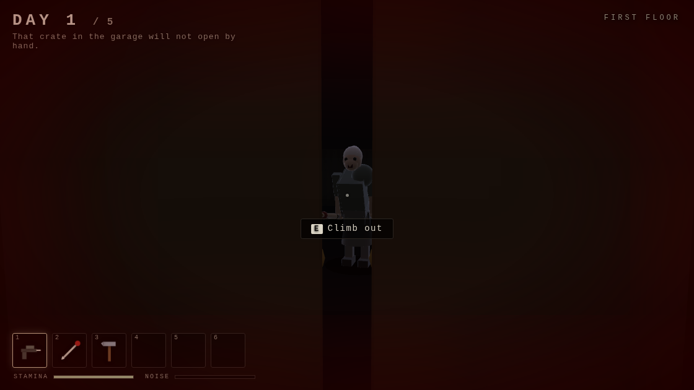

# GRANNY — Five Days

A browser horror-escape game in the mould of DVloper's mobile classic *Granny*:
you wake up locked in a house, you have five days to get out, and there is
someone downstairs who hears everything.

Real 3D, built on a hand-written WebGL renderer. No engine, no build step, no
libraries, no asset files — every wall texture, every model and every sound in
it is generated by the code at load time.



## Play it

```bash
# just open it — the scripts are classic <script> tags, so file:// works
xdg-open index.html      # or: open index.html   /   drag it into a browser
```

If you'd rather serve it:

```bash
python3 -m http.server 8000   # then visit http://localhost:8000/
```

Click **NEW GAME**, then click the view once to capture the mouse. Needs WebGL,
which every browser from the last decade has.

## Controls

| Key | |
|---|---|
| `W A S D` | Move |
| Mouse | Look |
| `Shift` | Sprint — fast and very loud |
| `Ctrl` | Crouch — slow and quiet |
| `E` / left click | Interact, pick up, place |
| `1`–`6` / wheel | Select inventory slot |
| `Q` | Drop the selected item |
| `F` | Torch on/off |
| `R` / right click | Fire the tranquilliser |
| `Esc` | Pause |

## How it plays

Five days, four floors, two ways out.

- **She hunts by sound.** Sprinting, slamming doors, smashing crates, dropping
  things and firing the tranquilliser all push a noise event with a radius; she
  walks to the loudest recent one. Creaky floorboards are scattered around the
  house and give you away wherever you are standing.
- **She hunts by sight too**, in a cone, with line of sight — and your torch
  extends the range she can pick you out at, so there is a real choice between
  seeing and being seen.
- **Getting caught costs a day, not your progress.** Doors you unlocked stay
  unlocked, crates you smashed stay smashed. What you were *carrying* spills
  onto the floor where she got you, and you wake back up in the bedroom. Day 5
  is the last one.
- **Hiding works** — wardrobes and beds — unless she watched you climb in. Shut
  the wardrobe door and you are looking out through the crack between the two
  doors, watching her feet go past.
- **Fighting back is temporary.** A dart drops her for twenty seconds; a bear
  trap holds her ankle for longer. Neither is a solution.
- Every day she is a little faster and hears a little further.



### The two exits

```
                       ┌─ screwdriver (bathroom)
                       │      └─ vent grate ── note ── safe (study) ── padlock key ─┐
front door ────────────┤                                                            ├── OUT
                       └─ master key (kitchen) ── her bedroom ── cogwheel ── winch ─┘

                       ┌─ hammer (basement) ── crate (garage) ── crowbar ───────────┐
sewer hatch ───────────┤                                                            ├── OUT
                       └─ master key (kitchen) ── her bedroom ── bolt cutters ──────┘
```

The safe code is randomised per run, so the note is never skippable.



## How it's built

| File | |
|---|---|
| `src/gl.js` | The WebGL layer: 4×4 matrix maths, shader compilation, texture upload, and the one shader everything is drawn with — a spotlight riding on the camera plus its near-field spill, hemispheric ambient modulated by baked AO, up to six point lights, rim light and exponential fog. |
| `src/mesh.js` | `MeshBuilder`: a transform stack and a handful of primitives (box, cylinder, sphere, extrusion, gear). Every model in the game is assembled from these. |
| `src/world3d.js` | Turns a level's tile grid into geometry — wall faces only where a solid cell meets an open one, floors and ceilings per room, door headers, and a baked ambient-occlusion value on every vertex so corners and floor junctions sink into shadow for free. |
| `src/models.js` | The furniture, the items, and Granny — built as separate limb meshes pivoted at their joints, posed each frame by a small skeleton (`GrannyRig`). |
| `src/render.js` | The frame: static geometry (one call per surface texture), swinging door leaves, flat-shaded objects, posed characters, contact shadows, and the item in your hands. |
| `src/textures.js` | Every surface as a per-pixel function — brick, damp wallpaper, cellar stone, floorboards, tiles, a corrugated shutter — plus the inventory icons. |
| `src/levels.js` | The house, declared as rooms, doors, furniture and lights. |
| `src/granny.js` | The state machine: patrol → investigate → chase → search, plus stunned/trapped. Follows you between floors by walking to the stairs. |
| `src/pathfind.js` | Grid BFS and line of sight. |
| `src/player.js` | Movement, collision (walls, furniture and swung door leaves), stamina, noise, hiding. |
| `src/game.js` | Rules, interaction, the day cycle, HUD, main loop. |
| `src/audio.js` | WebAudio synthesis — drone, footsteps, creaks, her scream. No sample files. |

A floor is about 3,000 triangles and draws in a dozen calls, so it runs at
vsync on anything with a GPU.

Tuning knobs worth knowing: `WALL_H` in `world3d.js` sets the ceiling height
(one grid cell is roughly 1.6 m across), the torch cone and ambient live at the
top of `Render.frame`, `Granny.setDay()` holds the per-day difficulty curve, and
each level's `ambient` and `fog` in `levels.js` set how dark a floor is.

## Legal

This is an original fan recreation of a genre, not a port. *Granny* was created
by **DVloper**; this repository contains none of that game's code, art, audio or
data — all of it is generated at runtime by the source here. Names of items and
rooms are generic. If you want the real thing, buy it on the App Store or Google
Play.
